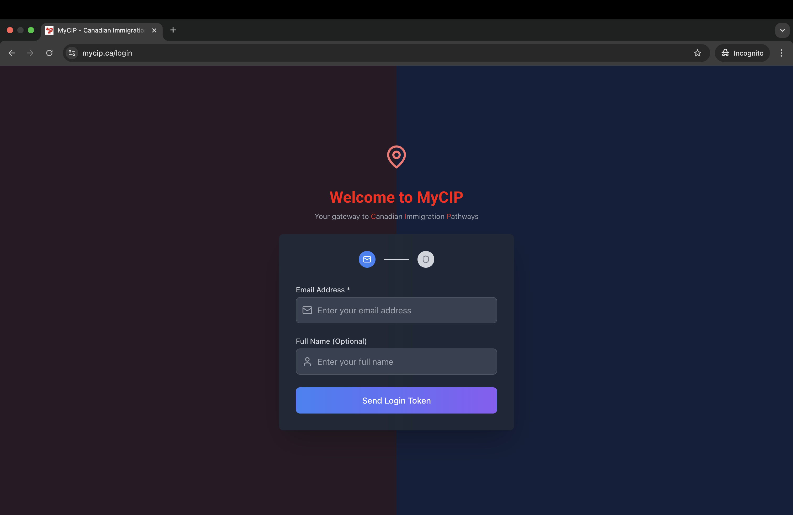
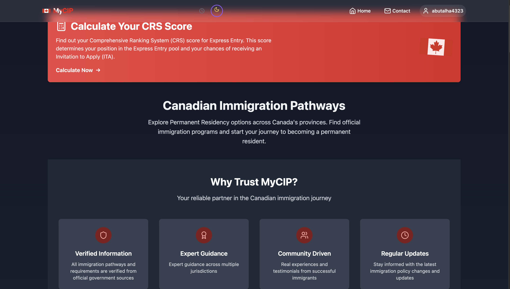

🇨🇦MyCIP: CANADIAN IMMIGRATION PATHWAYS cd ~ https://mycip.ca

Your trusted companion for navigating Canadian immigration pathways. Get expert guidance on PR applications, provincial programs, Calculate CRS Score and immigration updates, all under one space.

## Key Features

- **Comprehensive Province Guide** - Detailed information for all 13 Canadian provinces and territories.
- **Real-time Immigration Updates** - Latest policy changes and program updates
- **CRS Score Calculator** - Direct link to official government calculator.
- **Success Stories** - Real testimonials from successful immigrants
- **Expert Contact System** - WhatsApp integration for direct consultation
- **Hybrid Authentication** - Supports both Supabase and local storage users
- **Dark/Light Mode** - Auto-switching based on time of day
- **Mobile Responsive** - Optimized for all devices

## 🛠️ Tech Stack

- **Frontend**: React 18 + TypeScript + Vite
- **Styling**: Tailwind CSS with custom animations
- **Authentication**: Hybrid Supabase + Local Storage system
- **Routing**: React Router v6 with future flags
- **Icons & UI** | Lucide React + React Hot Toast
- **Deployment**: Netlify (custom domain via godaddy)

## 🏗️ Architecture

### Authentication System
- **Token-Based Authentication**: Email-based OTP system with 6-digit verification codes
- **Hybrid Approach**: Tries Supabase first, falls back to local storage for offline functionality
- **No Sign-Up Required**: Users authenticate directly with email + OTP token
- **User Preservation**: Maintains all existing users across both Supabase and local storage
- **Email Integration**: Custom Edge Function with Resend API for reliable email delivery
  

### Database Schema
- **User Profiles**: Comprehensive immigration profile data
- **Contact Messages**: WhatsApp-integrated contact system
- **Testimonials**: User success stories and ratings
- **Activity Logging**: User interaction tracking


## 🌐 Environment Variables

```env
VITE_SUPABASE_URL=your_supabase_url
VITE_SUPABASE_ANON_KEY=your_supabase_anon_key
```

## 📱 Contact Integration

The contact form integrates with WhatsApp for instant communication:
- **Auto-formatted Messages**: All form data is pre-formatted
- **Fallback System**: Instagram contact if WhatsApp fails

## 🎨 Design Features

- **Canadian Theme**: Red and white color scheme with flag animations
- **Apple-level Design**: Premium UI/UX with micro-interactions
- **Responsive Layout**: Mobile-first design approach
- **Accessibility**: WCAG compliant with proper contrast ratios

## 🔧 Development

### Available Scripts

- `npm run dev` - Start development server
- `npm run build` - Build for production
- `npm run preview` - Preview production build
- `npm run lint` - Run ESLint

### Project Structure

```
src/
├── components/          # Reusable UI components
├── context/            # React context providers
├── data/              # Static data and configurations
├── lib/               # Utility libraries and configurations
├── pages/             # Page components
├── types/             # TypeScript type definitions
└── main.tsx           # Application entry point
```

## 🚀 Deployment

### Netlify Deployment

1. **Build settings**:
   - Build command: `npm run build`
   - Publish directory: `dist`

2. **Environment variables**: Add your Supabase credentials

3. **Custom domain**: Configure `mycip.ca` with proper redirects

### Security Features

- **CSP Headers**: Content Security Policy implementation
- **HTTPS Enforcement**: Automatic HTTPS redirects
- **XSS Protection**: Cross-site scripting prevention
- **CSRF Protection**: Cross-site request forgery prevention

## 📊 Analytics & SEO

- **Google Search Console**: Verified ownership
- **Structured Data**: Schema.org implementation
- **Meta Tags**: Comprehensive social media optimization
- **Sitemap**: Auto-generated XML sitemap


## 👨‍💻 Author

**Talha**
- Instagram: [@ttalha_13](https://www.instagram.com/ttalha_13/)
- LinkedIn: [Talha](https://www.linkedin.com/in/talha-806869188/)
- Twitter: [@abu4323](https://x.com/abu4323)

## 📄 License

This project is **proprietary** and not open for public use, distribution, or modification.  
All rights are reserved by the author.  
Unauthorized copying or reuse of any part of this project is strictly prohibited.


## 🙏 Acknowledgments

- Immigration data sourced from official Government of Canada websites
- Province images from Unsplash
- Canadian flag from Wikimedia Commons
- Icons by Lucide React

---

**Made with ❤️ for the Canadian immigration community**
